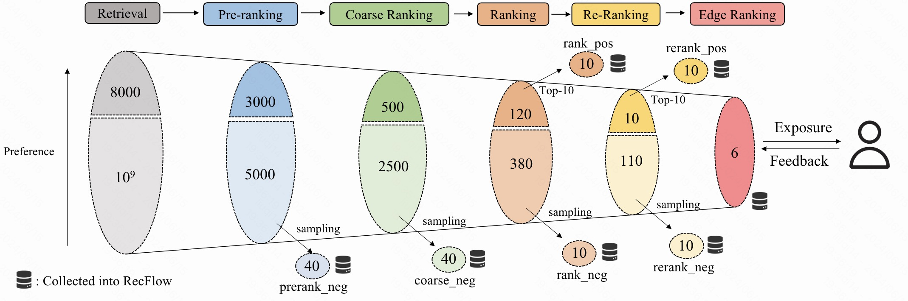

# RecFlow: An Industrial Full Flow Recommendation Dataset

[](https://github.com/RecFlow-nips24/RecFlow-nips24/blob/main/LICENSE)

### Motivation
To provide the recommendation systems (RS) research community with an industrial full flow dataset, we propose RecFlow, which includes samples from the exposure space and unexposed items filtered at each stage of Kuaishou's multi-stage RS. Compared with all existing public RS datasets, RecFlow can be leveraged to not only optimize the conventional recommendation tasks but also study the challenges including the interplay of different stages, the data distribution shift, auxiliary ranking tasks, user behavior sequence modeling, etc. It is the first public RS dataset that allows researchers to study the real industrial multi-stage RS.

The following figure illustrates the process of RecFlow's data collection .



### Usage
RecFlow can be applied to the following tasks. (1) By recording items from the serving space, RecFlow enables the study of how to alleviate the discrepancy between training and serving for specific stages during both the learning and evaluation processes. (2) RecFlow also records the stage information for different stage samples, facilitating research on joint modeling of multiple stages, such as stage consistency or optimal multi-stage RS. (3) The positive and negative samples from the exposure space are suitable for classical click-through rate prediction or sequential recommendation tasks. (4) RecFlow stores multiple types of positive feedback (e.g., effective view, long view, like, follow, share, comment), supporting research on multi-task recommendation. (5) Information about video duration and playing time for each exposure video allows the study of learning through implicit feedback, such as predicting playing time. (6) RecFlow includes a request identifier feature, which can contribute to studying the re-ranking problem. (7) Timestamps for each sample enable the aggregation of user feedback in chronological order, facilitating the study of user behavior sequence modeling algorithms. (8) RecFlow incorporates context, user, and video features beyond identity features (e.g., user ID and video ID), making it suitable for context-based recommendation. (9) The rich information recorded about RS and user feedback allows the construction of more accurate RS simulators or user models in feed scenarios. (10) Rich stage data may help estimate selection bias more accurately and design better debiasd algorithms. 

---

### Download the data

Download manually through the following links:

- link: [USTC Drive](https://rec.ustc.edu.cn/share/f8e5adc0-2e57-11ef-bea5-3b4cac9d110e)

---

### Dataset Organization

*RecFlow* dataset has following folders. **all_stage** contains data from all stages. **realshow** contains data from the exposure space. **seq_effective_50_dict** contains the user's effective_view behavior sequence of length 50. **request_id_dict** stores the data from all stages in first_level_key-second_level_key-value structure. The first_level_key is the *request_id*, the second_levele_key is the stage label (i.e. *realshow,rerank_pos,rerank_neg,rank_pos,rank_neg,coarse_neg,prerank_neg*), the value is the corresponding videos of that stage. **ubm_seq_request_id_dict**  is for the user behavior sequence modeling tasks and hold the same structure with **request_id_dict**. **id_cnt.pkl** records the unique ID number of each feature field. **retrieval_test.feather** is the testing dataset for retrieval experiments. **coarse_rank_test.feather** is the testing dataset for coarse ranking experiments. **rank_test.feather** is the testing dataset for ranking experiments. **realshow_video_info.feather** contains the video information from the exposure space. **realshow_video_info_daily** contains the accumulated video information from the exposure space.
  ```
  RecFlow
     ├── all_stage
     |   ├──2024-01-13.feather
     |   ├──2024-01-14.feather
     |   ├──...  
     |   └──2024-02-18.feather
     |       
     ├── realshow
     |   ├──2024-01-13.feather
     |   ├──2024-01-14.feather
     |   ├──...
     |   └──2024-02-18.feather
     |
     ├── seq_effective_50_dict
     |   ├──2024-01-13.pkl
     |   ├──2024-01-14.pkl
     |   ├──...
     |   └──2024-02-18.pkl
     |
     ├── request_id_dict
     |   ├──2024-01-13.pkl
     |   ├──2024-01-14.pkl
     |   ├──...
     |   └──2024-02-18.pkl
     |
     ├── ubm_seq_request_id_dict
     |   ├──2024-01-13.pkl
     |   ├──2024-01-14.pkl
     |   ├──...
     |   └──2024-02-18.pkl
     |
     └── others
        ├──id_cnt.pkl
        ├──retrieval_test.feather
        ├──coarse_rank_test.feather 
        ├──rank_test.feather
        ├──realshow_video_info.feather
        └──realshow_video_info_daily
           ├──2024-01-13.feather
           ├──2024-01-14.feather
           ├──...
           └──2024-02-18.feather
  ```

#### Descriptions of the feature fields in RecFlow. 

| Field Name:    | Description                                              | Type    |
| -------------- | -------------------------------------------------------- | ------- |
| request_id        | The unique ID of each recommendation request.                                      | Integer   |
| request\_timestamp       | The timestamp of each recommendation request.                              | Integer   |
| user\_id  | The unique ID of each user. | Integer   |
| device\_id | The unique ID of each device.                        | Integer   |
| age           | The user's age.                 | Integer     |
| gender           | The user's gender.                                 | Integer   |
| province      | The user's province.                                    | Integer |
| video\_id    | The unique ID of each video. | Integer |
| author\_id           | The unique ID of each author.            | Integer     |
| category\_level\_one           | The first level category ID of each video.                              | Integer   |
| category\_level\_two      | The second level category ID of each video.                                  | Integer |
| upload\_type    | The upload type ID of each video.  | Integer |
| upload\_timestamp           |The upload timestamp of each video.                | Integer     |
| duration           | The time duration of each video in milliseconds.                                | Integer   |
| realshow      | A binary feedback signal indicating the video is exposed to the user.                                         | Integer |
| rerank\_pos    | A binary feedback signal indicating the video ranks top-10 in rerank stage.  | Integer |
| rerank\_neg           | A binary feedback signal indicating the video ranks out of top-10 in rerank stage.                 | Integer     |
| rank\_pos           | A binary feedback signal indicating the video ranks top-10 in rank stage.                         | Integer   |
| rank\_neg      | A binary feedback signal indicating the video ranks out of top-10 in rank stage.                                     | Integer |
| coarse\_neg    | A binary feedback signal indicating the video ranks out of top-500 in coarse rank stage.   | Integer |
| prerank\_neg           | A binary feedback signal indicating the video ranks out of top-500 in pre-rank stage.                | Integer     |
| rank\_index           |The rank position of the video in the rank stage.                            | Integer   |
| rerank\_index      | The rank position of the video in rerank stage.                          | Integer |
| playing\_time    | The time duration of the user watching the video.       | Integer |
| effective\_view           | A binary feedback signal indicating the user watches at least 30\% of the video.              | Integer     |
| long\_view           | A binary feedback signal indicating the user watches at least 100\% of the video.                              | Integer   |
| like      | A binary feedback signal indicating the user hit the like button.                                      | Integer |
| follow    | A binary feedback signal indicating the user hit the follow the author button. | Integer |
| forward      | A binary feedback signal indicating the user forwards this video.                                          | Integer |
| comment      | A binary feedback signal indicating the user writes a comment in the comments section of this video                                         | Integer |

---

### Code
If you want to run the code in the repository, you need to download the data from [USTC Drive](https://rec.ustc.edu.cn/share/f8e5adc0-2e57-11ef-bea5-3b4cac9d110e), and place them in the data folder as above data organization.

#### Retrieval

Baseline
```
bash ./retrieval/run_sasrec.sh
```

Hard Negative Mining
```
bash ./retrieval/run_sasrec_hardnegmining.sh
```

Interplay between Retrieval and Subsequent Stages
```
bash ./retrieval/run_sasrec_fsltr.sh
```


#### Coarse Ranking

Baseline
```
bash ./coarse/run_dssm.sh
```

Data Distribution Shift
```
bash ./coarse/run_dssm_data_dist_shift_sampling.sh
bash ./coarse/run_dssm_data_dist_shift_all.sh
```

Interplay between Retrieval and Subsequent Stages
```
bash ./coarse/run_dssm_fsltr.sh
```

Auxiliary Ranking
```
bash ./coarse/run_dssm_auxiliary_ranking.sh
```

User Behavior Sequence Modeling
```
bash ./coarse/run_dssm_ubm.sh
```


#### Ranking

Baseline
```
bash ./rank/run_din.sh
```

Data Distribution Shift
```
bash ./rank/run_din_data_dist_shift_sampling.sh
bash ./rank/run_din_data_dist_shift_all.sh
```

Interplay between Retrieval and Subsequent Stages
```
bash ./rank/run_din_fsltr.sh
```

Auxiliary Ranking
```
bash ./rank/run_din_auxiliary_ranking.sh
```

User Behavior Sequence Modeling
```
bash ./rank/run_din_ubm.sh
```

### Requirements
```
python=3.7
numpy=1.19.2
pandas=1.3.5
pyarrow=8.0.0
scikit-learn=1.0.2
pytorch=1.6
faiss-gpu=1.7.1
```